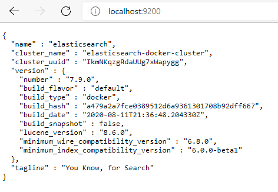

# 🛍️💱Ece Project - 📁Repository

[](https://conventionalcommits.org)

[](https://semver.org/spec/v2.0.0.html)

[](https://keepachangelog.com/en/1.1.0)

[](https://github.com/semantic-release/semantic-release)

[](https://github.com/Scheduler2000/ece-devops/actions)

# Team

| Name          | Position
|---------------| -----------
| Scheduler2000 | Main Developer

# Repository Structure

| Name                        | Description
|-----------------------------| -----------
| `code`                      | All the backend code
| `code/src`                  | Folder containing the impl of the user API with CRUD operations
| `code/tests`                | Folder containing tests related to the above REST API
| `infra`                     | All the docker logic, Kubernetes base setup and MySql script
| `infra/IaC`                 | All files related to Infrastructure as Code (Vagrant, Ansible)
| `infra/docker`              | docker related things : dockerfile, docker-compose configuration files 
| `infra/docker/volumes`      | Folder containing severals docker volumes for dockerize the app with a state
| `infra/kubernetes`          | Kubernetes related things: deployment, configmap, service
| `infra/kubernetes/api`      | Kubernetes configuration files related to the User API
| `infra/kubernetes/database` | Kubernetes configuration files related to the MySql database
| `infra/kubernetes/elk`      | Kubernetes configuration files related to the elk suite (kibana, elasticsearch)
| `infra/kubernetes/database` | Sql script for set up project-devops database with empty tables
| `docs`                      | All the business, architecture and guideline information
| `docs/image`                | Images used in the markdown files of the root description.
| `/`                         | git hook for ensuring the good format of git commit for the changelog generation
| `/`                         | configuration files related to [semantic-release](https://github.com/semantic-release/semantic-release)

# Branches

| Name         | Description
|--------------| ----------- 
| `master`     | main branch

# Github Actions

#### 1. ⚙️ Compilee️ Code 📑

- Build artefacts out of code compilation
- Every commit to every branch, and pull requests

#### 2. 🧿 Test Code 📑

- Run unit and integration tests
- Every commit to every branch, and pull requests

#### 3. 🚢 Publish Artefacts 🗽

- Build artefacts and push into a [docker registry](https://hub.docker.com/r/salamander93/ece-devops-2021/)
- Every commit to every branch, and pull requests

## Pre-requisites

* [Docker](https://docs.docker.com/get-docker/)
* [Docker Compose](https://docs.docker.com/compose/install/)
* [Kubernetes](https://kubernetes.io/fr/docs/setup/learning-environment/minikube/)

## ASP.NET 6.0 REST API
User API implementation using [MVC Architecture](https://docs.microsoft.com/en-us/aspnet/core/mvc/overview?view=aspnetcore-6.0), [Dapper](https://github.com/DapperLib/Dapper) as a micro-orm, [MySQL](https://www.mysql.com/fr/) as a Server Provider and [Open API](https://github.com/OAI/OpenAPI-Specification),
including following features:

* CRUD operations using MVC Approach.NET 6.0 and Mysql
* Health Checks implementation for kubernetes probes
* Open API - Support for Swagger  
* Monitoring with [Serilog](https://serilog.net/) and [kibana](https://www.elastic.co/what-is/kibana) coupled with [elasticsearch](https://www.elastic.co/)
<br/> 
<br/>

### Development Environment

* Jetbrains Rider
* DataGrip
* .NET 6.0 SDK
* Mysql Connector
* Dotnet CLI
* NPM

### Instructions
To build and run the project using the command line:

1. Install npm packages with ```npm install``` in root folder.
2. Install packages dependencies using ```dotnet restore``` in root folder.
3. Create the database with DataGrip or via CLI and execute ``ìnfra/sql/database.sql``
4. Run the project with ```dotnet run```
5. Point your browser to [here](http://localhost:5000)
6. NB : In this case the logs will be output only on the output console, if you want logs on kibana you have to up kibana and elasticsearch containers via docker or docker-compose

If you don't have all tools mentioned above in <em>Development Environment</em>,
you can run the project using the following command : ```docker-compose up``` in the following folder : ``infra/docker`` .


**NB:** If you ran into this error ````max virtual memory areas vm.max_map_count [65530]  is too low, increase to at least [262144]````
Here is the solution :
   1. Make sure docker daemon is running
   2. Open a terminal in adminstrator
   3. wsl -d docker-desktop (only for Windows users)
   4. sysctl -w vm.max_map_count=262144

You can also run the project using kubernetes instead of Docker Compose :
1. Start local kubernetes cluster with ```minikube start```
   
2. Make sure you're on minikube context : 
   
3. Apply kubernetes configuration files with ```kubectl apply -f kubernetes/ --recursive``` in `infra` folder
   
4. Verify that the ConfigMaps are created  ```kubectl get configmap```
5. Check list of up and running pods ```kubectl get pods```
6. Verify that Services are running ```kubectl get services```
7. Get the IP Address of the kibana and user api ```minikube service list```
   
8. For Cleaning up  : ```kubectl delete -f kubernetes/ --recursive``` in `infra` folder.
   

## List of all the work performed

| Subject                                                                           | Code | Max. grade |
|:----------------------------------------------------------------------------------|:----:|:----------:|
| Enriched web application with automated tests                                     | APP  |     +1     |
| Continuous Integration and Continuous Delivery (and Deployment) - Docker Registry | CICD |     +3     |
| Containerisation with Docker                                                      |  D   |     +1     |
| Orchestration with Docker Compose                                                 |  DC  |     +2     |
| Orchestration with Kubernetes	                                                    | KUB  |     +3     |
| Monitoring Kibana/Elasticsearch                                                   | MON  |     +2     |
| Infrastructure as code using Ansible and Vagrant (partially)                      | MON  |     +2     |
| Accurate project documentation in README.md file + Schema                         | DOC  |     +3     |
| Bonus Tasks : C#, Mysql, Swagger,                                                 | BNS  |     +1     |
| Bonus Tasks : conventional commits, git hooks, changelog gen                      | BNS  |     +1     |

## Changelog Generation


# Author
Tasnim Bennacer <br/>
tasnim.bennacer@edu.ece.fr <br/>
Student at [ECE Paris](https://www.ece.fr/)